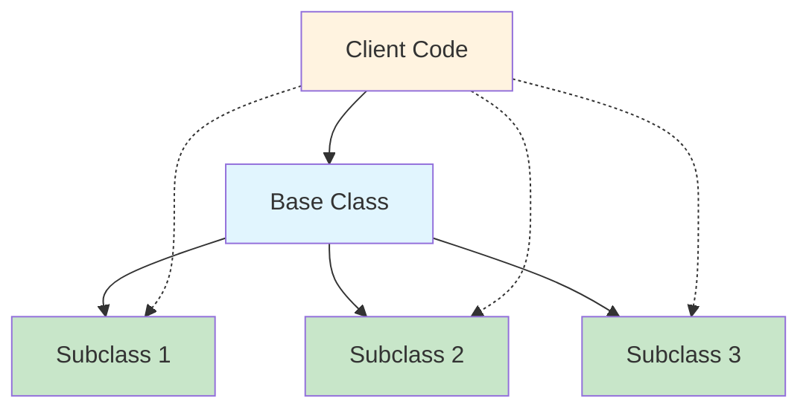
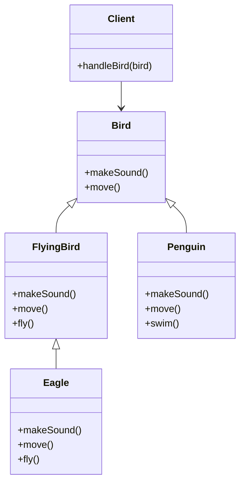

# Liskov Substitution Principle (LSP) - JavaScript/Node.js


## Overview

The **Liskov Substitution Principle** is the third principle of SOLID design principles, formulated by Barbara Liskov in 1987. It states that:

> "Objects of a superclass should be replaceable with objects of a subclass without breaking the application."

In JavaScript terms: **If class S extends class T, then objects of type T should be replaceable with objects of type S without altering the correctness of the program.**

## Key Concepts

### What LSP Ensures
- **Behavioral Substitutability**: Subclasses must be substitutable for their base classes
- **Contract Compliance**: Derived classes must honor the contracts established by base classes
- **Polymorphism Safety**: Enables safe use of polymorphism without unexpected behavior

### LSP Rules
1. **Preconditions cannot be strengthened** in subclasses
2. **Postconditions cannot be weakened** in subclasses  
3. **Invariants must be preserved** in subclasses
4. **History constraint** - subclasses shouldn't allow state changes that base class doesn't permit

## Visual Representation



## Architecture Diagram



## Examples

### ✅ Good Example - LSP Compliant

```javascript
// Base class for all birds
class Bird {
    makeSound() {
        throw new Error("makeSound() must be implemented");
    }
    
    move() {
        throw new Error("move() must be implemented");
    }
}

// Specialized class for flying birds
class FlyingBird extends Bird {
    fly() {
        throw new Error("fly() must be implemented");
    }
    
    move() {
        return this.fly();
    }
}

// Concrete implementation - Eagle
class Eagle extends FlyingBird {
    makeSound() {
        return "Screech!";
    }
    
    fly() {
        return "Flying high in the sky";
    }
}

// Concrete implementation - Penguin
class Penguin extends Bird {
    makeSound() {
        return "Squawk!";
    }
    
    move() {
        return "Swimming in water";
    }
    
    swim() {
        return "Swimming gracefully";
    }
}

// Client code - works with any Bird
class BirdSanctuary {
    static handleBird(bird) {
        console.log(`Bird sound: ${bird.makeSound()}`);
        console.log(`Bird movement: ${bird.move()}`);
    }
}

// Usage - Both work seamlessly
const eagle = new Eagle();
const penguin = new Penguin();

BirdSanctuary.handleBird(eagle);    // ✅ Works perfectly
BirdSanctuary.handleBird(penguin);  // ✅ Works perfectly
```

### ❌ Bad Example - LSP Violation

```javascript
// Base Rectangle class
class Rectangle {
    constructor(width, height) {
        this._width = width;
        this._height = height;
    }
    
    setWidth(width) {
        this._width = width;
    }
    
    setHeight(height) {
        this._height = height;
    }
    
    getArea() {
        return this._width * this._height;
    }
    
    getWidth() {
        return this._width;
    }
    
    getHeight() {
        return this._height;
    }
}

// Square that violates LSP
class Square extends Rectangle {
    constructor(side) {
        super(side, side);
    }
    
    setWidth(width) {
        this._width = width;
        this._height = width;  // ❌ Violates LSP!
    }
    
    setHeight(height) {
        this._width = height;  // ❌ Violates LSP!
        this._height = height;
    }
}

// Client code expecting Rectangle behavior
function resizeRectangle(rectangle) {
    rectangle.setWidth(5);
    rectangle.setHeight(4);
    
    const expectedArea = 5 * 4; // 20
    const actualArea = rectangle.getArea();
    
    console.log(`Expected: ${expectedArea}, Actual: ${actualArea}`);
    
    if (actualArea !== expectedArea) {
        throw new Error("Area calculation failed!");
    }
}

// Usage
const rect = new Rectangle(2, 3);
resizeRectangle(rect);  // ✅ Works: Expected: 20, Actual: 20

const square = new Square(3);
resizeRectangle(square);  // ❌ Fails: Expected: 20, Actual: 16
```

### ✅ Fixed Example - LSP Compliant

```javascript
// Base Shape interface
class Shape {
    getArea() {
        throw new Error("getArea() must be implemented");
    }
}

// Rectangle implementation
class Rectangle extends Shape {
    constructor(width, height) {
        super();
        this._width = width;
        this._height = height;
    }
    
    setWidth(width) {
        this._width = width;
    }
    
    setHeight(height) {
        this._height = height;
    }
    
    getArea() {
        return this._width * this._height;
    }
}

// Square implementation
class Square extends Shape {
    constructor(side) {
        super();
        this._side = side;
    }
    
    setSide(side) {
        this._side = side;
    }
    
    getArea() {
        return this._side * this._side;
    }
}

// Client code works with Shape interface
class AreaCalculator {
    static calculateArea(shape) {
        return shape.getArea();
    }
    
    static calculateTotalArea(shapes) {
        return shapes.reduce((total, shape) => total + shape.getArea(), 0);
    }
}

// Usage - Both work correctly
const rect = new Rectangle(5, 4);
const square = new Square(4);

console.log(`Rectangle area: ${AreaCalculator.calculateArea(rect)}`);  // ✅ 20
console.log(`Square area: ${AreaCalculator.calculateArea(square)}`);    // ✅ 16

const shapes = [rect, square];
console.log(`Total area: ${AreaCalculator.calculateTotalArea(shapes)}`); // ✅ 36
```

## Real-World Applications

### 1. Database Connections

```javascript
// Base database connection
class DatabaseConnection {
    connect() {
        throw new Error("connect() must be implemented");
    }
    
    executeQuery(query) {
        throw new Error("executeQuery() must be implemented");
    }
    
    disconnect() {
        throw new Error("disconnect() must be implemented");
    }
}

// MySQL implementation
class MySQLConnection extends DatabaseConnection {
    connect() {
        console.log("Connected to MySQL");
        return Promise.resolve("MySQL connected");
    }
    
    executeQuery(query) {
        console.log(`Executing MySQL query: ${query}`);
        return Promise.resolve({ result: "MySQL result" });
    }
    
    disconnect() {
        console.log("Disconnected from MySQL");
        return Promise.resolve();
    }
}

// PostgreSQL implementation
class PostgreSQLConnection extends DatabaseConnection {
    connect() {
        console.log("Connected to PostgreSQL");
        return Promise.resolve("PostgreSQL connected");
    }
    
    executeQuery(query) {
        console.log(`Executing PostgreSQL query: ${query}`);
        return Promise.resolve({ result: "PostgreSQL result" });
    }
    
    disconnect() {
        console.log("Disconnected from PostgreSQL");
        return Promise.resolve();
    }
}

// Database service that works with any connection
class DatabaseService {
    constructor(connection) {
        this.connection = connection;
    }
    
    async performDatabaseOperation(query) {
        try {
            await this.connection.connect();
            const result = await this.connection.executeQuery(query);
            await this.connection.disconnect();
            return result;
        } catch (error) {
            console.error("Database operation failed:", error);
            throw error;
        }
    }
}

// Usage - Both work seamlessly
const mysqlService = new DatabaseService(new MySQLConnection());
const postgresService = new DatabaseService(new PostgreSQLConnection());
```

### 2. Payment Processing

```javascript
// Base payment processor
class PaymentProcessor {
    processPayment(amount) {
        throw new Error("processPayment() must be implemented");
    }
    
    validatePayment(amount) {
        if (amount <= 0) {
            throw new Error("Payment amount must be positive");
        }
    }
}

// Credit card processor
class CreditCardProcessor extends PaymentProcessor {
    processPayment(amount) {
        this.validatePayment(amount);
        console.log(`Processing $${amount} via Credit Card`);
        return {
            transactionId: `CC_${Date.now()}`,
            amount: amount,
            status: "success"
        };
    }
}

// PayPal processor
class PayPalProcessor extends PaymentProcessor {
    processPayment(amount) {
        this.validatePayment(amount);
        console.log(`Processing $${amount} via PayPal`);
        return {
            transactionId: `PP_${Date.now()}`,
            amount: amount,
            status: "success"
        };
    }
}

// Crypto processor
class CryptoProcessor extends PaymentProcessor {
    processPayment(amount) {
        this.validatePayment(amount);
        console.log(`Processing $${amount} via Cryptocurrency`);
        return {
            transactionId: `CRYPTO_${Date.now()}`,
            amount: amount,
            status: "success"
        };
    }
}

// E-commerce service
class ECommerceService {
    constructor(paymentProcessor) {
        this.paymentProcessor = paymentProcessor;
    }
    
    checkout(amount) {
        try {
            const result = this.paymentProcessor.processPayment(amount);
            console.log("Payment successful:", result);
            return result;
        } catch (error) {
            console.error("Payment failed:", error);
            throw error;
        }
    }
}

// Usage - All processors work interchangeably
const creditCardService = new ECommerceService(new CreditCardProcessor());
const paypalService = new ECommerceService(new PayPalProcessor());
const cryptoService = new ECommerceService(new CryptoProcessor());
```

### 3. File Storage System

```javascript
// Base file storage
class FileStorage {
    upload(filename, data) {
        throw new Error("upload() must be implemented");
    }
    
    download(filename) {
        throw new Error("download() must be implemented");
    }
    
    delete(filename) {
        throw new Error("delete() must be implemented");
    }
}

// Local file storage
class LocalFileStorage extends FileStorage {
    upload(filename, data) {
        console.log(`Uploading ${filename} to local storage`);
        // Local file system logic
        return Promise.resolve({ path: `/local/${filename}`, size: data.length });
    }
    
    download(filename) {
        console.log(`Downloading ${filename} from local storage`);
        return Promise.resolve({ data: "file content", filename });
    }
    
    delete(filename) {
        console.log(`Deleting ${filename} from local storage`);
        return Promise.resolve(true);
    }
}

// AWS S3 storage
class S3FileStorage extends FileStorage {
    upload(filename, data) {
        console.log(`Uploading ${filename} to AWS S3`);
        // AWS S3 logic
        return Promise.resolve({ 
            bucket: "my-bucket", 
            key: filename, 
            size: data.length 
        });
    }
    
    download(filename) {
        console.log(`Downloading ${filename} from AWS S3`);
        return Promise.resolve({ data: "file content", filename });
    }
    
    delete(filename) {
        console.log(`Deleting ${filename} from AWS S3`);
        return Promise.resolve(true);
    }
}

// File manager service
class FileManager {
    constructor(storage) {
        this.storage = storage;
    }
    
    async manageFile(operation, filename, data = null) {
        try {
            switch (operation) {
                case 'upload':
                    return await this.storage.upload(filename, data);
                case 'download':
                    return await this.storage.download(filename);
                case 'delete':
                    return await this.storage.delete(filename);
                default:
                    throw new Error(`Unknown operation: ${operation}`);
            }
        } catch (error) {
            console.error(`File operation failed: ${error.message}`);
            throw error;
        }
    }
}
```

## Benefits of Following LSP

1. **Reliable Polymorphism**: Ensures safe substitution of objects
2. **Robust Code**: Prevents unexpected behavior when using inheritance
3. **Maintainable Systems**: Makes code easier to extend and modify
4. **Better Testing**: Enables comprehensive testing of hierarchies
5. **Design Clarity**: Forces clear thinking about class relationships

## Common LSP Violations

### 1. Strengthening Preconditions
```javascript
// ❌ Bad: Subclass has stricter requirements
class User {
    setEmail(email) {
        // Base class accepts any string
        this.email = email;
    }
}

class PremiumUser extends User {
    setEmail(email) {
        // ❌ Stricter validation than base class
        if (!email.includes('@premium.com')) {
            throw new Error('Premium users must use @premium.com email');
        }
        super.setEmail(email);
    }
}
```

### 2. Weakening Postconditions
```javascript
// ❌ Bad: Subclass provides weaker guarantees
class Calculator {
    divide(a, b) {
        if (b === 0) throw new Error('Division by zero');
        return a / b;
    }
}

class FlexibleCalculator extends Calculator {
    divide(a, b) {
        // ❌ Weaker postcondition - doesn't throw error
        return b === 0 ? Infinity : a / b;
    }
}
```

### 3. Throwing New Exceptions
```javascript
// ❌ Bad: Subclass throws exceptions not in base class
class DataProcessor {
    process(data) {
        return data.toUpperCase();
    }
}

class StrictDataProcessor extends DataProcessor {
    process(data) {
        // ❌ New exception type not in base class
        if (data.includes('badword')) {
            throw new TypeError('Invalid content detected');
        }
        return super.process(data);
    }
}
```

## How to Identify LSP Violations

1. **Type checking**: If you need `instanceof` checks, LSP might be violated
2. **Empty implementations**: Subclasses with empty or exception-throwing methods
3. **Conditional logic**: Client code with conditions based on subclass types
4. **Unexpected behavior**: Substitution causes different behavior than expected

## Testing LSP Compliance

```javascript
// Test suite for LSP compliance
class LSPTestSuite {
    static testBirdSubstitution() {
        const birds = [new Eagle(), new Penguin()];
        
        birds.forEach(bird => {
            // All birds should be able to make sound and move
            const sound = bird.makeSound();
            const movement = bird.move();
            
            console.assert(typeof sound === 'string', 'Sound should be string');
            console.assert(typeof movement === 'string', 'Movement should be string');
            console.assert(sound.length > 0, 'Sound should not be empty');
            console.assert(movement.length > 0, 'Movement should not be empty');
        });
        
        console.log('✅ Bird substitution test passed');
    }
    
    static testShapeSubstitution() {
        const shapes = [new Rectangle(5, 4), new Square(4)];
        
        shapes.forEach(shape => {
            const area = shape.getArea();
            console.assert(typeof area === 'number', 'Area should be number');
            console.assert(area > 0, 'Area should be positive');
        });
        
        console.log('✅ Shape substitution test passed');
    }
    
    static testPaymentProcessorSubstitution() {
        const processors = [
            new CreditCardProcessor(),
            new PayPalProcessor(),
            new CryptoProcessor()
        ];
        
        processors.forEach(processor => {
            const result = processor.processPayment(100);
            console.assert(result.transactionId, 'Should have transaction ID');
            console.assert(result.amount === 100, 'Amount should match');
            console.assert(result.status === 'success', 'Status should be success');
        });
        
        console.log('✅ Payment processor substitution test passed');
    }
    
    static runAllTests() {
        console.log('Running LSP compliance tests...\n');
        
        this.testBirdSubstitution();
        this.testShapeSubstitution();
        this.testPaymentProcessorSubstitution();
        
        console.log('\n🎉 All LSP compliance tests passed!');
    }
}

// Run tests
LSPTestSuite.runAllTests();
```

## Best Practices

1. **Design by Contract**: Clearly define preconditions, postconditions, and invariants
2. **Favor Composition**: Consider composition over inheritance when LSP is difficult
3. **Interface Segregation**: Use smaller, focused interfaces
4. **Unit Testing**: Test all subclasses through base class interface
5. **Documentation**: Clearly document expected behavior and contracts

## npm Scripts for Testing

```json
{
  "scripts": {
    "test": "node test/lsp-tests.js",
    "test:watch": "nodemon test/lsp-tests.js",
    "lint": "eslint src/**/*.js",
    "example": "node examples/lsp-examples.js"
  }
}
```

## Project Structure
```
liskov-substitution-principle/
├── src/
│   ├── shapes/
│   │   ├── Shape.js
│   │   ├── Rectangle.js
│   │   └── Square.js
│   ├── birds/
│   │   ├── Bird.js
│   │   ├── Eagle.js
│   │   └── Penguin.js
│   └── payments/
│       ├── PaymentProcessor.js
│       ├── CreditCardProcessor.js
│       └── PayPalProcessor.js
├── test/
│   └── lsp-tests.js
├── examples/
│   └── lsp-examples.js
├── README.md
└── package.json
```

## Contributing

1. Fork the repository
2. Create a feature branch
3. Add examples following LSP principles
4. Include tests for your examples
5. Submit a pull request

## License

MIT License - see LICENSE file for details.

---

**Remember**: The Liskov Substitution Principle ensures that inheritance hierarchies are well-designed and that polymorphism works correctly. Following LSP leads to more maintainable, robust, and predictable code.