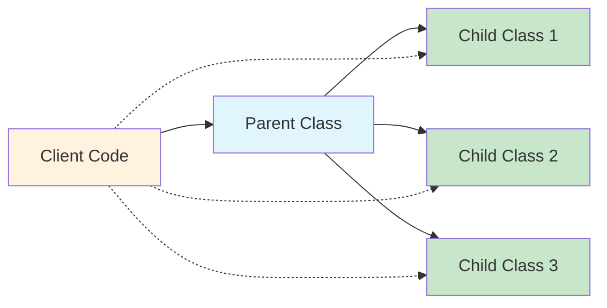

# Liskov Substitution Principle (LSP) 🔄

 

## Table of Contents

- [Liskov Substitution Principle (LSP) 🔄](#liskov-substitution-principle-lsp-)
  - [Table of Contents](#table-of-contents)
  - [What is LSP?](#what-is-lsp)
  - [Visual Representation](#visual-representation)
  - [Basic Examples](#basic-examples)
    - [❌ Bad Example - LSP Violation](#-bad-example---lsp-violation)
    - [✅ Good Example - LSP Compliant](#-good-example---lsp-compliant)
  - [Classic Example: Rectangle vs Square](#classic-example-rectangle-vs-square)
    - [❌ Bad Implementation](#-bad-implementation)
    - [✅ Good Implementation](#-good-implementation)
  - [Real-World Examples](#real-world-examples)
    - [Payment Processing System](#payment-processing-system)
      - [❌ LSP Violation](#-lsp-violation)
      - [✅ LSP Compliant](#-lsp-compliant)
    - [Media Player Application](#media-player-application)
      - [❌ LSP Violation](#-lsp-violation-1)
      - [✅ LSP Compliant](#-lsp-compliant-1)
    - [Database Connection Management](#database-connection-management)
      - [❌ LSP Violation](#-lsp-violation-2)
      - [✅ LSP Compliant](#-lsp-compliant-2)
    - [E-commerce Shipping Calculator](#e-commerce-shipping-calculator)
      - [❌ LSP Violation](#-lsp-violation-3)
      - [✅ LSP Compliant](#-lsp-compliant-3)
    - [User Authentication System](#user-authentication-system)
      - [❌ LSP Violation](#-lsp-violation-4)
      - [✅ LSP Compliant](#-lsp-compliant-4)
  - [Testing for LSP Compliance](#testing-for-lsp-compliance)
  - [Common LSP Violations](#common-lsp-violations)
  - [Key Takeaways](#key-takeaways)
  - [Why LSP Matters](#why-lsp-matters)

## What is LSP?

**Definition:** If class `S` is a subclass of class `T`, then objects of type `T` should be replaceable with objects of type `S` without altering the correctness of the program.

**In Simple Terms:** You should be able to use a child class wherever a parent class is expected, and everything should work as expected.

## Visual Representation



## Basic Examples

### ❌ Bad Example - LSP Violation

```javascript
// Base class
class Bird {
    fly() {
        return "Flying in the sky";
    }
}

// Subclass that breaks LSP
class Ostrich extends Bird {
    fly() {
        throw new Error("Ostrich can't fly!"); // 💥 Breaks the contract!
    }
}

// Client code
function makeItFly(bird) {
    return bird.fly();
}

// Usage
const duck = new Bird();
console.log(makeItFly(duck)); // ✅ Works: "Flying in the sky"

const ostrich = new Ostrich();
console.log(makeItFly(ostrich)); // ❌ Crashes: Error thrown!
```

**Problem:** `Ostrich` can't be substituted for `Bird` without breaking the program.

### ✅ Good Example - LSP Compliant

```javascript
// Base class
class Bird {
    makeSound() {
        return "Generic bird sound";
    }
    
    move() {
        return "Moving around";
    }
}

// Flying birds
class FlyingBird extends Bird {
    move() {
        return "Flying in the sky";
    }
}

// Ground birds
class GroundBird extends Bird {
    move() {
        return "Walking on ground";
    }
}

// Concrete implementations
class Eagle extends FlyingBird {
    makeSound() {
        return "Screech!";
    }
}

class Ostrich extends GroundBird {
    makeSound() {
        return "Boom!";
    }
}

// Client code
function handleBird(bird) {
    console.log(`Sound: ${bird.makeSound()}`);
    console.log(`Movement: ${bird.move()}`);
}

// Usage - All work perfectly!
const eagle = new Eagle();
const ostrich = new Ostrich();

handleBird(eagle);   // ✅ Works perfectly
handleBird(ostrich); // ✅ Works perfectly
```

## Classic Example: Rectangle vs Square

### ❌ Bad Implementation

```javascript
class Rectangle {
    constructor(width, height) {
        this.width = width;
        this.height = height;
    }
    
    setWidth(width) {
        this.width = width;
    }
    
    setHeight(height) {
        this.height = height;
    }
    
    getArea() {
        return this.width * this.height;
    }
}

class Square extends Rectangle {
    constructor(side) {
        super(side, side);
    }
    
    setWidth(width) {
        this.width = width;
        this.height = width; // 💥 Breaks LSP!
    }
    
    setHeight(height) {
        this.width = height;  // 💥 Breaks LSP!
        this.height = height;
    }
}

// Client code
function resizeRectangle(rectangle) {
    rectangle.setWidth(5);
    rectangle.setHeight(4);
    console.log(`Area: ${rectangle.getArea()}`); // Expected: 20
}

const rect = new Rectangle(2, 3);
resizeRectangle(rect); // ✅ Area: 20

const square = new Square(3);
resizeRectangle(square); // ❌ Area: 16 (Expected: 20)
```

### ✅ Good Implementation

```javascript
// Base class
class Shape {
    getArea() {
        throw new Error("Must implement getArea()");
    }
}

// Separate implementations
class Rectangle extends Shape {
    constructor(width, height) {
        super();
        this.width = width;
        this.height = height;
    }
    
    setWidth(width) {
        this.width = width;
    }
    
    setHeight(height) {
        this.height = height;
    }
    
    getArea() {
        return this.width * this.height;
    }
}

class Square extends Shape {
    constructor(side) {
        super();
        this.side = side;
    }
    
    setSide(side) {
        this.side = side;
    }
    
    getArea() {
        return this.side * this.side;
    }
}

// Client code
function calculateArea(shape) {
    return shape.getArea();
}

const rect = new Rectangle(5, 4);
const square = new Square(4);

console.log(`Rectangle area: ${calculateArea(rect)}`); // ✅ 20
console.log(`Square area: ${calculateArea(square)}`);   // ✅ 16
```

## Real-World Examples

### Payment Processing System

#### ❌ LSP Violation

```javascript
class PaymentProcessor {
    processPayment(amount) {
        return `Processing payment of $${amount}`;
    }
}

class CreditCardProcessor extends PaymentProcessor {
    processPayment(amount) {
        if (amount > 10000) {
            throw new Error("Credit card limit exceeded!"); // 💥 Breaks LSP!
        }
        return `Processing credit card payment of $${amount}`;
    }
}

class PayPalProcessor extends PaymentProcessor {
    processPayment(amount) {
        if (amount < 1) {
            throw new Error("PayPal minimum is $1!"); // 💥 Breaks LSP!
        }
        return `Processing PayPal payment of $${amount}`;
    }
}

// Client code
function processOrder(processor, amount) {
    return processor.processPayment(amount);
}

// This breaks with different processors
const creditCard = new CreditCardProcessor();
const paypal = new PayPalProcessor();

console.log(processOrder(creditCard, 15000)); // ❌ Throws error
console.log(processOrder(paypal, 0.5)); // ❌ Throws error
```

#### ✅ LSP Compliant

```javascript
class PaymentProcessor {
    processPayment(amount) {
        const validation = this.validatePayment(amount);
        if (!validation.isValid) {
            return { success: false, error: validation.error };
        }
        return this.executePayment(amount);
    }
    
    validatePayment(amount) {
        return { isValid: true };
    }
    
    executePayment(amount) {
        return { success: true, message: `Payment of $${amount} processed` };
    }
}

class CreditCardProcessor extends PaymentProcessor {
    validatePayment(amount) {
        if (amount > 10000) {
            return { isValid: false, error: "Credit card limit exceeded" };
        }
        return { isValid: true };
    }
    
    executePayment(amount) {
        return { success: true, message: `Credit card payment of $${amount} processed` };
    }
}

class PayPalProcessor extends PaymentProcessor {
    validatePayment(amount) {
        if (amount < 1) {
            return { isValid: false, error: "PayPal minimum is $1" };
        }
        return { isValid: true };
    }
    
    executePayment(amount) {
        return { success: true, message: `PayPal payment of $${amount} processed` };
    }
}

// Client code
function processOrder(processor, amount) {
    const result = processor.processPayment(amount);
    if (result.success) {
        console.log(`✅ ${result.message}`);
    } else {
        console.log(`❌ ${result.error}`);
    }
}

// Now all processors work consistently
const creditCard = new CreditCardProcessor();
const paypal = new PayPalProcessor();

processOrder(creditCard, 5000);  // ✅ Works
processOrder(creditCard, 15000); // ✅ Handles gracefully
processOrder(paypal, 10);        // ✅ Works
processOrder(paypal, 0.5);       // ✅ Handles gracefully
```

### Media Player Application

#### ❌ LSP Violation

```javascript
class MediaPlayer {
    play(file) {
        return `Playing ${file}`;
    }
    
    pause() {
        return "Paused";
    }
    
    stop() {
        return "Stopped";
    }
}

class AudioPlayer extends MediaPlayer {
    play(file) {
        if (!file.endsWith('.mp3') && !file.endsWith('.wav')) {
            throw new Error("Audio player only supports MP3 and WAV"); // 💥 Breaks LSP!
        }
        return `Playing audio: ${file}`;
    }
}

class VideoPlayer extends MediaPlayer {
    play(file) {
        if (!file.endsWith('.mp4') && !file.endsWith('.avi')) {
            throw new Error("Video player only supports MP4 and AVI"); // 💥 Breaks LSP!
        }
        return `Playing video: ${file}`;
    }
}

// Client code
function playMedia(player, file) {
    return player.play(file);
}

const audioPlayer = new AudioPlayer();
const videoPlayer = new VideoPlayer();

console.log(playMedia(audioPlayer, "song.mp4")); // ❌ Throws error
console.log(playMedia(videoPlayer, "song.mp3")); // ❌ Throws error
```

#### ✅ LSP Compliant

```javascript
class MediaPlayer {
    play(file) {
        if (!this.canPlay(file)) {
            return { success: false, error: `Cannot play ${file}` };
        }
        return this.executePlay(file);
    }
    
    canPlay(file) {
        return true; // Base implementation accepts all
    }
    
    executePlay(file) {
        return { success: true, message: `Playing ${file}` };
    }
    
    pause() {
        return "Paused";
    }
    
    stop() {
        return "Stopped";
    }
}

class AudioPlayer extends MediaPlayer {
    canPlay(file) {
        return file.endsWith('.mp3') || file.endsWith('.wav');
    }
    
    executePlay(file) {
        return { success: true, message: `Playing audio: ${file}` };
    }
}

class VideoPlayer extends MediaPlayer {
    canPlay(file) {
        return file.endsWith('.mp4') || file.endsWith('.avi');
    }
    
    executePlay(file) {
        return { success: true, message: `Playing video: ${file}` };
    }
}

// Client code
function playMedia(player, file) {
    const result = player.play(file);
    if (result.success) {
        console.log(`✅ ${result.message}`);
    } else {
        console.log(`❌ ${result.error}`);
    }
}

const audioPlayer = new AudioPlayer();
const videoPlayer = new VideoPlayer();

playMedia(audioPlayer, "song.mp3");  // ✅ Works
playMedia(audioPlayer, "song.mp4");  // ✅ Handles gracefully
playMedia(videoPlayer, "movie.mp4"); // ✅ Works
playMedia(videoPlayer, "song.mp3");  // ✅ Handles gracefully
```

### Database Connection Management

#### ❌ LSP Violation

```javascript
class DatabaseConnection {
    connect() {
        return "Connected to database";
    }
    
    query(sql) {
        return `Executing: ${sql}`;
    }
    
    disconnect() {
        return "Disconnected from database";
    }
}

class ReadOnlyConnection extends DatabaseConnection {
    query(sql) {
        if (sql.toLowerCase().includes('insert') || 
            sql.toLowerCase().includes('update') || 
            sql.toLowerCase().includes('delete')) {
            throw new Error("Read-only connection!"); // 💥 Breaks LSP!
        }
        return `Executing read-only: ${sql}`;
    }
}

// Client code
function executeQuery(connection, sql) {
    return connection.query(sql);
}

const readOnlyConn = new ReadOnlyConnection();
console.log(executeQuery(readOnlyConn, "INSERT INTO users...")); // ❌ Throws error
```

#### ✅ LSP Compliant

```javascript
class DatabaseConnection {
    connect() {
        return "Connected to database";
    }
    
    query(sql) {
        if (!this.canExecute(sql)) {
            return { success: false, error: "Operation not allowed" };
        }
        return this.executeQuery(sql);
    }
    
    canExecute(sql) {
        return true; // Base implementation allows all
    }
    
    executeQuery(sql) {
        return { success: true, result: `Executing: ${sql}` };
    }
    
    disconnect() {
        return "Disconnected from database";
    }
}

class ReadOnlyConnection extends DatabaseConnection {
    canExecute(sql) {
        const writeOperations = ['insert', 'update', 'delete'];
        return !writeOperations.some(op => sql.toLowerCase().includes(op));
    }
    
    executeQuery(sql) {
        return { success: true, result: `Executing read-only: ${sql}` };
    }
}

// Client code
function executeQuery(connection, sql) {
    const result = connection.query(sql);
    if (result.success) {
        console.log(`✅ ${result.result}`);
    } else {
        console.log(`❌ ${result.error}`);
    }
}

const readOnlyConn = new ReadOnlyConnection();
executeQuery(readOnlyConn, "SELECT * FROM users"); // ✅ Works
executeQuery(readOnlyConn, "INSERT INTO users..."); // ✅ Handles gracefully
```

### E-commerce Shipping Calculator

#### ❌ LSP Violation

```javascript
class ShippingCalculator {
    calculateShipping(weight, distance) {
        return weight * 0.5 + distance * 0.1;
    }
}

class ExpressShipping extends ShippingCalculator {
    calculateShipping(weight, distance) {
        if (weight > 50) {
            throw new Error("Express shipping not available for heavy items!"); // 💥 Breaks LSP!
        }
        return (weight * 0.5 + distance * 0.1) * 2;
    }
}

class InternationalShipping extends ShippingCalculator {
    calculateShipping(weight, distance) {
        if (distance < 1000) {
            throw new Error("International shipping requires minimum 1000km!"); // 💥 Breaks LSP!
        }
        return (weight * 0.5 + distance * 0.1) * 3;
    }
}
```

#### ✅ LSP Compliant

```javascript
class ShippingCalculator {
    calculateShipping(weight, distance) {
        if (!this.isAvailable(weight, distance)) {
            return { available: false, reason: "Shipping not available" };
        }
        return { 
            available: true, 
            cost: this.computeCost(weight, distance) 
        };
    }
    
    isAvailable(weight, distance) {
        return true; // Base implementation is always available
    }
    
    computeCost(weight, distance) {
        return weight * 0.5 + distance * 0.1;
    }
}

class ExpressShipping extends ShippingCalculator {
    isAvailable(weight, distance) {
        return weight <= 50;
    }
    
    computeCost(weight, distance) {
        return (weight * 0.5 + distance * 0.1) * 2;
    }
}

class InternationalShipping extends ShippingCalculator {
    isAvailable(weight, distance) {
        return distance >= 1000;
    }
    
    computeCost(weight, distance) {
        return (weight * 0.5 + distance * 0.1) * 3;
    }
}

// Client code
function getShippingQuote(calculator, weight, distance) {
    const result = calculator.calculateShipping(weight, distance);
    if (result.available) {
        console.log(`✅ Shipping cost: $${result.cost.toFixed(2)}`);
    } else {
        console.log(`❌ ${result.reason}`);
    }
}

const express = new ExpressShipping();
const international = new InternationalShipping();

getShippingQuote(express, 25, 500);      // ✅ Works
getShippingQuote(express, 75, 500);      // ✅ Handles gracefully
getShippingQuote(international, 25, 1500); // ✅ Works
getShippingQuote(international, 25, 500);  // ✅ Handles gracefully
```

### User Authentication System

#### ❌ LSP Violation

```javascript
class AuthenticationService {
    authenticate(username, password) {
        return username === 'admin' && password === 'admin123';
    }
}

class TwoFactorAuth extends AuthenticationService {
    authenticate(username, password) {
        throw new Error("Two-factor auth requires additional token!"); // 💥 Breaks LSP!
    }
    
    authenticateWithToken(username, password, token) {
        const basicAuth = super.authenticate(username, password);
        return basicAuth && token === '123456';
    }
}
```

#### ✅ LSP Compliant

```javascript
class AuthenticationService {
    authenticate(credentials) {
        return this.validateCredentials(credentials);
    }
    
    validateCredentials(credentials) {
        const { username, password } = credentials;
        return username === 'admin' && password === 'admin123';
    }
}

class TwoFactorAuth extends AuthenticationService {
    validateCredentials(credentials) {
        const { username, password, token } = credentials;
        
        // First validate basic credentials
        const basicAuth = super.validateCredentials({ username, password });
        
        // Then validate token if basic auth passes
        return basicAuth && token === '123456';
    }
}

// Client code
function loginUser(authService, credentials) {
    const isAuthenticated = authService.authenticate(credentials);
    if (isAuthenticated) {
        console.log("✅ User authenticated successfully");
    } else {
        console.log("❌ Authentication failed");
    }
}

const basicAuth = new AuthenticationService();
const twoFactorAuth = new TwoFactorAuth();

// Both work with the same interface
loginUser(basicAuth, { username: 'admin', password: 'admin123' });
loginUser(twoFactorAuth, { username: 'admin', password: 'admin123', token: '123456' });
```

## Testing for LSP Compliance

```javascript
// Generic LSP test function
function testLSP(parentClass, childClasses, testCases) {
    console.log(`Testing LSP compliance for ${parentClass.name}`);
    
    testCases.forEach((testCase, index) => {
        console.log(`\n--- Test Case ${index + 1} ---`);
        
        // Test parent class
        const parentInstance = new parentClass();
        const parentResult = testCase.operation(parentInstance);
        console.log(`Parent result: ${JSON.stringify(parentResult)}`);
        
        // Test all child classes
        childClasses.forEach(ChildClass => {
            const childInstance = new ChildClass();
            const childResult = testCase.operation(childInstance);
            
            // Check if child behaves consistently with parent
            if (typeof parentResult === typeof childResult) {
                console.log(`✅ ${ChildClass.name}: ${JSON.stringify(childResult)}`);
            } else {
                console.log(`❌ ${ChildClass.name}: Inconsistent behavior!`);
            }
        });
    });
}

// Example usage
testLSP(
    Shape,
    [Rectangle, Square],
    [
        { operation: (shape) => shape.getArea() }
    ]
);
```

## Common LSP Violations

| ❌ Violation | ✅ Solution |
|-------------|-------------|
| Throwing exceptions in subclass | Design proper inheritance hierarchy |
| Strengthening preconditions | Keep same or weaker preconditions |
| Weakening postconditions | Keep same or stronger postconditions |
| Changing expected behavior | Honor parent class contracts |
| Requiring additional parameters | Use optional parameters or configuration objects |
| Removing functionality | Create more specific base classes |

## Key Takeaways

1. **Subclasses must be substitutable** for their parent classes
2. **Don't break the contract** established by the parent class
3. **Design inheritance carefully** - sometimes composition is better
4. **Test substitutability** - if you need `instanceof` checks, you might be violating LSP
5. **Return consistent types** - don't change return types between parent and child
6. **Handle edge cases gracefully** - don't throw exceptions where parent wouldn't
7. **Use configuration objects** for methods that need different parameters

## Why LSP Matters

✅ **Reliable polymorphism** - Code works with any subclass  
✅ **Maintainable code** - Easy to extend without breaking existing functionality  
✅ **Fewer bugs** - Consistent behavior across inheritance hierarchy  
✅ **Better design** - Forces you to think about proper abstractions  
✅ **Testable code** - You can test parent and child classes the same way  
✅ **Flexible architecture** - Easy to swap implementations  

---

**Remember:** If you can't replace a parent with a child without breaking things, you're violating LSP! 🚫➡️✅