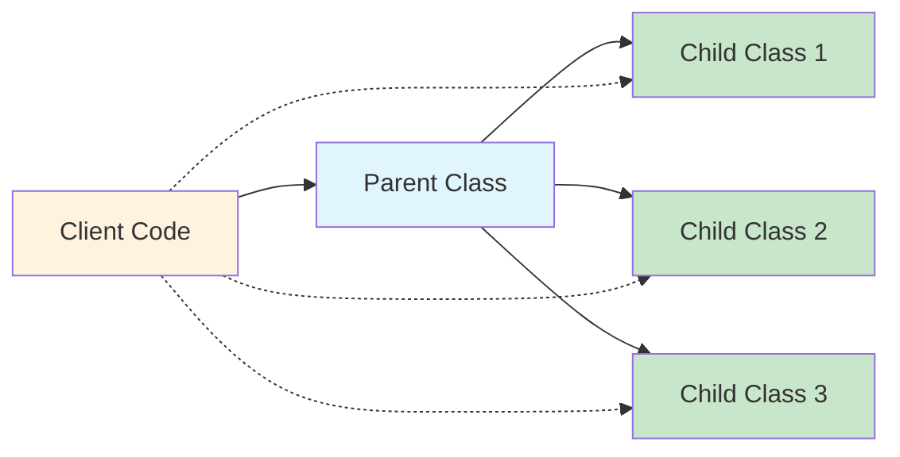

# Liskov Substitution Principle (LSP) 🔄

 

## What is LSP?

**Definition:** If class `S` is a subclass of class `T`, then objects of type `T` should be replaceable with objects of type `S` without altering the correctness of the program.

**In Simple Terms:** You should be able to use a child class wherever a parent class is expected, and everything should work as expected.

## Visual Representation



## ❌ Bad Example - LSP Violation

```javascript
// Base class
class Bird {
    fly() {
        return "Flying in the sky";
    }
}

// Subclass that breaks LSP
class Ostrich extends Bird {
    fly() {
        throw new Error("Ostrich can't fly!"); // 💥 Breaks the contract!
    }
}

// Client code
function makeItFly(bird) {
    return bird.fly();
}

// Usage
const duck = new Bird();
console.log(makeItFly(duck)); // ✅ Works: "Flying in the sky"

const ostrich = new Ostrich();
console.log(makeItFly(ostrich)); // ❌ Crashes: Error thrown!
```

**Problem:** `Ostrich` can't be substituted for `Bird` without breaking the program.

## ✅ Good Example - LSP Compliant

```javascript
// Base class
class Bird {
    makeSound() {
        return "Generic bird sound";
    }
    
    move() {
        return "Moving around";
    }
}

// Flying birds
class FlyingBird extends Bird {
    move() {
        return "Flying in the sky";
    }
}

// Ground birds
class GroundBird extends Bird {
    move() {
        return "Walking on ground";
    }
}

// Concrete implementations
class Eagle extends FlyingBird {
    makeSound() {
        return "Screech!";
    }
}

class Ostrich extends GroundBird {
    makeSound() {
        return "Boom!";
    }
}

// Client code
function handleBird(bird) {
    console.log(`Sound: ${bird.makeSound()}`);
    console.log(`Movement: ${bird.move()}`);
}

// Usage - All work perfectly!
const eagle = new Eagle();
const ostrich = new Ostrich();

handleBird(eagle);   // ✅ Works perfectly
handleBird(ostrich); // ✅ Works perfectly
```

## Real-World Example: Rectangle vs Square

### ❌ Bad Implementation

```javascript
class Rectangle {
    constructor(width, height) {
        this.width = width;
        this.height = height;
    }
    
    setWidth(width) {
        this.width = width;
    }
    
    setHeight(height) {
        this.height = height;
    }
    
    getArea() {
        return this.width * this.height;
    }
}

class Square extends Rectangle {
    constructor(side) {
        super(side, side);
    }
    
    setWidth(width) {
        this.width = width;
        this.height = width; // 💥 Breaks LSP!
    }
    
    setHeight(height) {
        this.width = height;  // 💥 Breaks LSP!
        this.height = height;
    }
}

// Client code
function resizeRectangle(rectangle) {
    rectangle.setWidth(5);
    rectangle.setHeight(4);
    console.log(`Area: ${rectangle.getArea()}`); // Expected: 20
}

const rect = new Rectangle(2, 3);
resizeRectangle(rect); // ✅ Area: 20

const square = new Square(3);
resizeRectangle(square); // ❌ Area: 16 (Expected: 20)
```

### ✅ Good Implementation

```javascript
// Base class
class Shape {
    getArea() {
        throw new Error("Must implement getArea()");
    }
}

// Separate implementations
class Rectangle extends Shape {
    constructor(width, height) {
        super();
        this.width = width;
        this.height = height;
    }
    
    setWidth(width) {
        this.width = width;
    }
    
    setHeight(height) {
        this.height = height;
    }
    
    getArea() {
        return this.width * this.height;
    }
}

class Square extends Shape {
    constructor(side) {
        super();
        this.side = side;
    }
    
    setSide(side) {
        this.side = side;
    }
    
    getArea() {
        return this.side * this.side;
    }
}

// Client code
function calculateArea(shape) {
    return shape.getArea();
}

const rect = new Rectangle(5, 4);
const square = new Square(4);

console.log(`Rectangle area: ${calculateArea(rect)}`); // ✅ 20
console.log(`Square area: ${calculateArea(square)}`);   // ✅ 16
```

## Quick Test for LSP Compliance

```javascript
// Test function to verify LSP
function testLSP() {
    const shapes = [
        new Rectangle(5, 4),
        new Square(4)
    ];
    
    shapes.forEach(shape => {
        const area = shape.getArea();
        console.assert(typeof area === 'number', 'Area should be a number');
        console.assert(area > 0, 'Area should be positive');
    });
    
    console.log('✅ LSP Test Passed!');
}

testLSP();
```

## Common LSP Violations

| ❌ Violation | ✅ Solution |
|-------------|-------------|
| Throwing exceptions in subclass | Design proper inheritance hierarchy |
| Strengthening preconditions | Keep same or weaker preconditions |
| Weakening postconditions | Keep same or stronger postconditions |
| Changing expected behavior | Honor parent class contracts |

## Key Takeaways

1. **Subclasses must be substitutable** for their parent classes
2. **Don't break the contract** established by the parent class
3. **Design inheritance carefully** - sometimes composition is better
4. **Test substitutability** - if you need `instanceof` checks, you might be violating LSP

## Why LSP Matters

✅ **Reliable polymorphism**  
✅ **Maintainable code**  
✅ **Fewer bugs**  
✅ **Better design**  

---

**Remember:** If you can't replace a parent with a child without breaking things, you're violating LSP! 🚫➡️✅