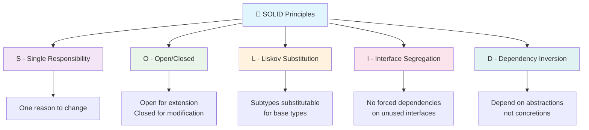
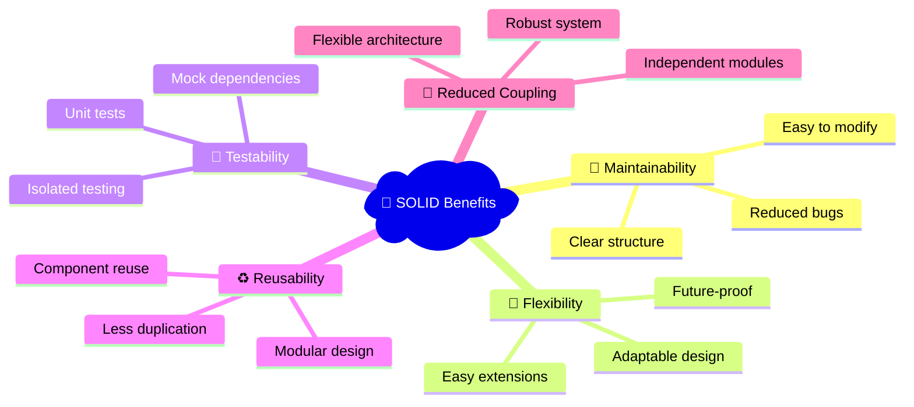

# 🧱 SOLID Principles

<div align="center">


**Making software designs more understandable, flexible, and maintainable**

[📖 Overview](#overview) • [🎯 Principles](#principles) • [🏗️ Examples](#examples) • [📊 Benefits](#benefits) • [🚀 Getting Started](#getting-started)

</div>

---

## 📖 Overview

**SOLID** is an acronym for five design principles that help create robust, maintainable, and scalable software:



---

## 🎯 Principles

### 1️⃣ Single Responsibility Principle (SRP)

> 💡 **"A class should have only one reason to change"**

<details>
<summary>📋 <strong>Click to expand example</strong></summary>

#### ❌ Violation Example
```javascript
// ❌ This class has multiple responsibilities
class User {
  constructor(name, email) {
    this.name = name;
    this.email = email;
  }
  
  saveToDB() {
    // Database logic - Responsibility 1
    console.log('Saving to database...');
  }

  sendEmail() {
    // Email logic - Responsibility 2
    console.log('Sending email...');
  }
  
  validateInput() {
    // Validation logic - Responsibility 3
    return this.name && this.email;
  }
}
```

#### ✅ Correct Implementation
```javascript
// ✅ Each class has a single responsibility
class User {
  constructor(name, email) {
    this.name = name;
    this.email = email;
  }
}

class UserRepository {
  saveToDB(user) {
    console.log(`Saving ${user.name} to database...`);
  }
}

class EmailService {
  sendEmail(user) {
    console.log(`Sending email to ${user.email}...`);
  }
}

class UserValidator {
  validate(user) {
    return user.name && user.email;
  }
}
```

**🎯 Real-world analogy:** Think of a restaurant where the chef cooks, the waiter serves, and the cashier handles payments - each has one clear responsibility!

</details>

---

### 2️⃣ Open/Closed Principle (OCP)

> 💡 **"Software entities should be open for extension, but closed for modification"**

<details>
<summary>📋 <strong>Click to expand example</strong></summary>

#### ❌ Violation Example
```javascript
// ❌ Need to modify existing code for new shapes
class AreaCalculator {
  calculateArea(shape) {
    if (shape.type === 'circle') {
      return Math.PI * shape.radius * shape.radius;
    }
    else if (shape.type === 'square') {
      return shape.side * shape.side;
    }
    // Need to add more if-else for new shapes 😞
  }
}
```

#### ✅ Correct Implementation
```javascript
// ✅ Extensible without modification
class Shape {
  calculateArea() {
    throw new Error('calculateArea method must be implemented');
  }
}

class Circle extends Shape {
  constructor(radius) {
    super();
    this.radius = radius;
  }
  
  calculateArea() {
    return Math.PI * this.radius * this.radius;
  }
}

class Square extends Shape {
  constructor(side) {
    super();
    this.side = side;
  }
  
  calculateArea() {
    return this.side * this.side;
  }
}

// Easy to add new shapes without modifying existing code! 🎉
class Triangle extends Shape {
  constructor(base, height) {
    super();
    this.base = base;
    this.height = height;
  }
  
  calculateArea() {
    return (this.base * this.height) / 2;
  }
}

class AreaCalculator {
  calculateArea(shape) {
    return shape.calculateArea();
  }
}
```

**🎯 Real-world analogy:** Like a USB port - you can plug in new devices without changing the port itself!

</details>

---

### 3️⃣ Liskov Substitution Principle (LSP)

> 💡 **"Subtypes must be substitutable for their base types"**

<details>
<summary>📋 <strong>Click to expand example</strong></summary>

#### ❌ Violation Example
```javascript
// ❌ Ostrich breaks the expected behavior
class Bird {
  fly() {
    return 'Flying high in the sky! 🕊️';
  }
}

class Duck extends Bird {
  fly() {
    return 'Duck flying over the pond! 🦆';
  }
}

class Ostrich extends Bird {
  fly() {
    throw new Error('Ostriches cannot fly! 🚫'); // Breaks LSP
  }
}

// This will fail for Ostrich
function makeBirdFly(bird) {
  return bird.fly(); // Expects all birds to fly
}
```

#### ✅ Correct Implementation
```javascript
// ✅ Proper inheritance hierarchy
class Bird {
  move() {
    return 'Moving around... 🐦';
  }
  
  makeSound() {
    return 'Chirp chirp! 🎵';
  }
}

class FlyingBird extends Bird {
  fly() {
    return 'Soaring through the sky! ✈️';
  }
  
  move() {
    return this.fly();
  }
}

class FlightlessBird extends Bird {
  run() {
    return 'Running fast on the ground! 🏃‍♂️';
  }
  
  move() {
    return this.run();
  }
}

class Duck extends FlyingBird {
  fly() {
    return 'Duck flying gracefully! 🦆';
  }
  
  makeSound() {
    return 'Quack quack! 🦆';
  }
}

class Ostrich extends FlightlessBird {
  run() {
    return 'Ostrich running at 70 km/h! 🏃‍♂️💨';
  }
  
  makeSound() {
    return 'Boom boom! 🔊';
  }
}

// Now this works for all birds
function moveBird(bird) {
  return bird.move(); // All birds can move
}
```

**🎯 Real-world analogy:** Like different types of vehicles - all can transport people, but cars drive on roads while boats sail on water!

</details>

---

### 4️⃣ Interface Segregation Principle (ISP)

> 💡 **"Clients should not be forced to depend on interfaces they do not use"**

<details>
<summary>📋 <strong>Click to expand example</strong></summary>

#### ❌ Violation Example
```javascript
// ❌ Fat interface forces unnecessary implementations
class AllInOneMachine {
  print(document) {
    throw new Error('Must implement print');
  }
  
  scan(document) {
    throw new Error('Must implement scan');
  }
  
  fax(document) {
    throw new Error('Must implement fax');
  }
  
  copy(document) {
    throw new Error('Must implement copy');
  }
}

class SimplePrinter extends AllInOneMachine {
  print(document) {
    console.log(`Printing: ${document} 🖨️`);
  }
  
  // Forced to implement methods it doesn't need 😞
  scan(document) {
    throw new Error('This printer cannot scan');
  }
  
  fax(document) {
    throw new Error('This printer cannot fax');
  }
  
  copy(document) {
    throw new Error('This printer cannot copy');
  }
}
```

#### ✅ Correct Implementation
```javascript
// ✅ Segregated interfaces
class Printer {
  print(document) {
    throw new Error('Must implement print');
  }
}

class Scanner {
  scan(document) {
    throw new Error('Must implement scan');
  }
}

class FaxMachine {
  fax(document) {
    throw new Error('Must implement fax');
  }
}

class PhotoCopier {
  copy(document) {
    throw new Error('Must implement copy');
  }
}

// Simple printer only implements what it needs
class BasicPrinter extends Printer {
  print(document) {
    console.log(`Printing: ${document} 🖨️`);
  }
}

// Multi-function printer implements multiple interfaces
class MultiFunctionPrinter extends Printer {
  constructor() {
    super();
    this.scanner = new AdvancedScanner();
    this.faxMachine = new ModernFaxMachine();
    this.photoCopier = new DigitalPhotoCopier();
  }
  
  print(document) {
    console.log(`High-quality printing: ${document} 🖨️✨`);
  }
  
  scan(document) {
    return this.scanner.scan(document);
  }
  
  fax(document) {
    return this.faxMachine.fax(document);
  }
  
  copy(document) {
    return this.photoCopier.copy(document);
  }
}

class AdvancedScanner extends Scanner {
  scan(document) {
    console.log(`Scanning: ${document} 📄`);
  }
}

class ModernFaxMachine extends FaxMachine {
  fax(document) {
    console.log(`Faxing: ${document} 📠`);
  }
}

class DigitalPhotoCopier extends PhotoCopier {
  copy(document) {
    console.log(`Copying: ${document} 📋`);
  }
}
```

**🎯 Real-world analogy:** Like a Swiss Army knife vs. individual tools - sometimes you need just a knife, not all the tools!

</details>

---

### 5️⃣ Dependency Inversion Principle (DIP)

> 💡 **"Depend on abstractions, not on concretions"**

<details>
<summary>📋 <strong>Click to expand example</strong></summary>

#### ❌ Violation Example
```javascript
// ❌ High-level module depends on low-level module
class MySQLDatabase {
  save(data) {
    console.log(`Saving to MySQL: ${data} 🗄️`);
  }
}

class UserService {
  constructor() {
    this.database = new MySQLDatabase(); // Direct dependency
  }
  
  saveUser(user) {
    // Tightly coupled to MySQL
    this.database.save(user);
  }
}
```

#### ✅ Correct Implementation
```javascript
// ✅ Depend on abstractions
class Database {
  save(data) {
    throw new Error('save method must be implemented');
  }
  
  find(id) {
    throw new Error('find method must be implemented');
  }
}

class MySQLDatabase extends Database {
  save(data) {
    console.log(`💾 Saving to MySQL: ${JSON.stringify(data)}`);
    return { id: Math.random(), ...data };
  }
  
  find(id) {
    console.log(`🔍 Finding in MySQL with ID: ${id}`);
    return { id, name: 'John Doe' };
  }
}

class PostgreSQLDatabase extends Database {
  save(data) {
    console.log(`🐘 Saving to PostgreSQL: ${JSON.stringify(data)}`);
    return { id: Math.random(), ...data };
  }
  
  find(id) {
    console.log(`🔍 Finding in PostgreSQL with ID: ${id}`);
    return { id, name: 'Jane Smith' };
  }
}

class MongoDatabase extends Database {
  save(data) {
    console.log(`🍃 Saving to MongoDB: ${JSON.stringify(data)}`);
    return { _id: Math.random(), ...data };
  }
  
  find(id) {
    console.log(`🔍 Finding in MongoDB with ID: ${id}`);
    return { _id: id, name: 'Bob Johnson' };
  }
}

class UserService {
  constructor(database) {
    this.database = database; // Dependency injection
  }
  
  saveUser(user) {
    return this.database.save(user);
  }
  
  getUser(id) {
    return this.database.find(id);
  }
}

// Usage examples - Easy to switch databases! 🔄
const mysqlService = new UserService(new MySQLDatabase());
const postgresService = new UserService(new PostgreSQLDatabase());
const mongoService = new UserService(new MongoDatabase());

// All work the same way
mysqlService.saveUser({ name: 'Alice', email: 'alice@example.com' });
postgresService.saveUser({ name: 'Bob', email: 'bob@example.com' });
mongoService.saveUser({ name: 'Charlie', email: 'charlie@example.com' });
```

**🎯 Real-world analogy:** Like electrical outlets - your device works with any outlet because it depends on the standard interface, not the specific power source!

</details>

---

## 📊 Benefits of Following SOLID Principles



### 🎯 Key Advantages

| Principle | Primary Benefit | Impact |
|-----------|----------------|--------|
| **SRP** | 🎯 **Clarity** | Each class has a clear, single purpose |
| **OCP** | 🚀 **Extensibility** | Add features without changing existing code |
| **LSP** | 🔄 **Reliability** | Predictable behavior across inheritance |
| **ISP** | ⚡ **Efficiency** | Use only what you need |
| **DIP** | 🔧 **Flexibility** | Easy to swap implementations |

---

## 🚀 Getting Started

### 📦 Installation

```bash
# Clone the repository
git clone https://github.com/manish0502/SOLID_Principles.git

# Navigate to project directory
cd SOLID_Principles

# Install dependencies
npm install --save-dev typescript ts-node

# Run examples
npx ts-node srp.ts
```

### 🏃‍♂️ Quick Start

```javascript
// Import the examples
import { UserService, MySQLDatabase } from './examples/dependency-inversion.js';
import { Circle, Square, AreaCalculator } from './examples/open-closed.js';

// Try out the examples
const userService = new UserService(new MySQLDatabase());
userService.saveUser({ name: 'John', email: 'john@example.com' });

const circle = new Circle(5);
const square = new Square(4);
const calculator = new AreaCalculator();

console.log(`Circle area: ${calculator.calculateArea(circle)}`);
console.log(`Square area: ${calculator.calculateArea(square)}`);
```

---

## 📚 Additional Resources

- 📖 [Clean Code by Robert C. Martin](https://www.amazon.com/Clean-Code-Handbook-Software-Craftsmanship/dp/0132350882)
- 🎥 [SOLID Principles Video Series](https://www.youtube.com/watch?v=example)
- 📝 [Design Patterns in JavaScript](https://github.com/example/design-patterns)
- 🧪 [Test-Driven Development Guide](https://github.com/example/tdd-guide)

---

## 🤝 Contributing

We welcome contributions! Please see our [Contributing Guide](CONTRIBUTING.md) for details.

1. Fork the repository
2. Create your feature branch (`git checkout -b feature/amazing-feature`)
3. Commit your changes (`git commit -m 'Add some amazing feature'`)
4. Push to the branch (`git push origin feature/amazing-feature`)
5. Open a Pull Request

---

## 📄 License

This project is licensed under the MIT License - see the [LICENSE](LICENSE) file for details.

---

## 🌟 Show Your Support

If this project helped you understand SOLID principles better, please ⭐ star this repository!

<div align="center">

**Made with ❤️ for better software design**

[⬆ Back to Top](#-solid-principles)

</div>
